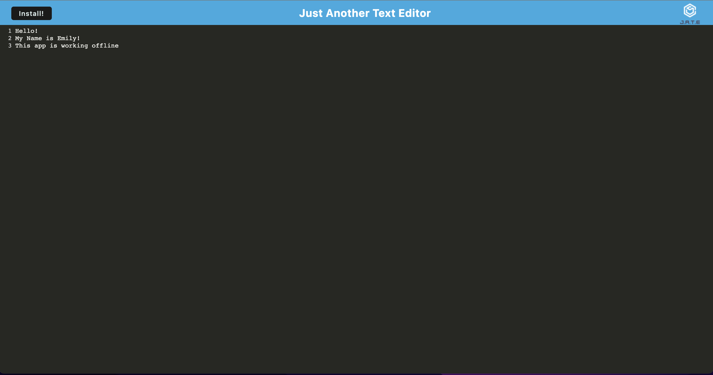

# PWA_JATE-APP

  ## Description
  This application provides a text editor app with functionality as a progressive web application to work offline and. Once the application was working as a standalone application it was deployed using Heroku. 
  
  ## Table of Contents (Optional)
  
  If your README is long, add a table of contents to make it easy for users to find what they need.
  - [Description](#description)
  - [Installation](#installation)
  - [Usage](#usage)
  - [Links](#links)

  
  ## Installation
  
  `git clone` the github repository to your computer. To run this application, you will have to install dependencies for it to work properly. 

  `npm i`
  followed by running: `npm run start:dev`
  
  Check to make sure all dependencies were installed in the package.json.
  ## Usage

  To use this app, open the app from the deployed Heroku link: https://jate-em.herokuapp.com/ and you will be able to use the app right away. To use offline, you will need to click the install button the left side of the window and download the application to your local machine. It will then create a shortcut to click on and open and use as much as you want offline.
  
   

   
    
    
  
  ## Links

 Heroku Deployment Link: https://jate-em.herokuapp.com/
 Github Repository: https://github.com/emmcewen/PWA_JATE-APP
